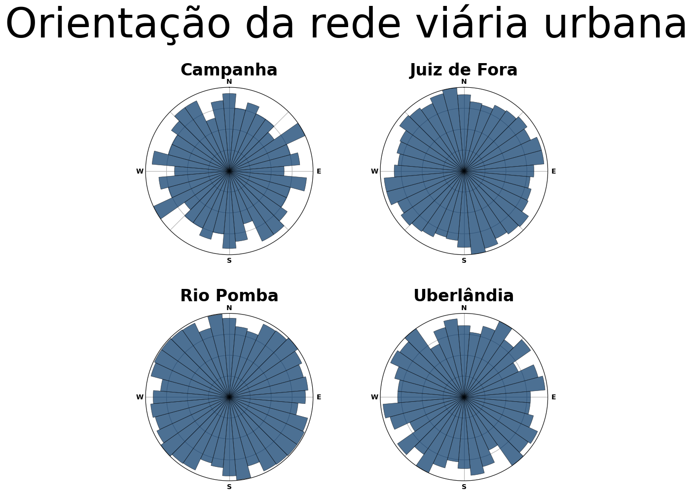
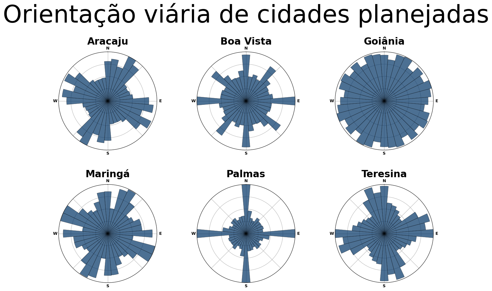

# Análise de redes viárias urbanas

O pacote **OSMnx**, desenvolvido e mantido por Geoff Boeing, professor
de Planejamento Urbano e Análise Espacial da USC - University of
Southern California, permite comparar a orientação espacial das redes
viárias de diferentes cidades.

Inicialmente, vamos analisar as seguintes cidades mineiras: Juiz de
Fora, Uberlândia, Campanha e Rio Pomba.

Juiz de Fora foi fundada em 31 de Maio de 1850, completando 175 anos em
2025. Conhecida como a \"Manchester Mineira\" por seu histórico
industrial, é uma das cidades mais importantes do interior de Minas
Gerais, com forte influência econômica e cultural na Zona da Mata.

Uberlândia nasceu em 31 de Agosto de 1888, somando 137 anos de história
em 2025. Segunda maior cidade de Minas Gerais, destaca-se como um dos
principais polos logísticos e tecnológicos do país, além de ser um
centro de agronegócio e serviços.

Campanha tem origens mais antigas, remontando a 2 de Outubro de 1737, o
que lhe confere 287 anos de existência. Localizada no Sul de Minas,
preserva um rico patrimônio histórico, com arquitetura colonial e
tradições religiosas que remetem ao ciclo do ouro e ao desenvolvimento
cafeeiro.

Rio Pomba, por sua vez, foi fundada em 25 de Dezembro de 1767,
acumulando 257 anos. Uma das cidades mais antigas da região da Zona da
Mata, possui forte ligação com a religiosidade católica e mantém traços
da arquitetura setecentista, sendo um testemunho vivo da colonização
mineira.

## Código Python

**Importamos as bibliotecas**
``` python
import matplotlib.pyplot as plt
import numpy as np
import osmnx as ox

weight_by_length = False

ox.__version__
```

**Definimos os locais para consulta**
``` python
# Definimos os locais para consulta
places = {
    'Teresina': 'Teresina, PI, Brasil',
    'Aracaju': 'Campanha, SE, Brasil',
    'Goiânia': 'Goiânia, GO, Brasil',
    'Boa Vista': 'Boa Vista, RR, Brasil',
    'Maringá': 'Maringá, PR, Brasil',
    'Palmas': 'Palmas, TO, Brasil',
   
}
```
**Geramos os diagramas**
``` python
# Criamos figuras e eixos
n = len(places)
ncols = int(np.ceil(np.sqrt(n)))
nrows = int(np.ceil(n / ncols))
figsize = (ncols * 5, nrows * 5)
fig, axes = plt.subplots(nrows, ncols, figsize=figsize, subplot_kw={"projection": "polar"})

# Criamos o diagrama de roseta de cada cidade
for ax, place in zip(axes.flat, sorted(places.keys())):
    print(ox.utils.ts(), place)

    # obter grafos não direcionados com aestas contendo atributos
    G = ox.graph.graph_from_place(place, network_type="drive")
    Gu = ox.bearing.add_edge_bearings(ox.convert.to_undirected(G))
    fig, ax = ox.plot.plot_orientation(Gu, ax=ax, title=place, area=True)

# Adicionamos títulos e salvamos o gráfico
suptitle_font = {
    "family": "DejaVu Sans",
    "fontsize": 60,
    "fontweight": "normal",
    "y": 1,
}
fig.suptitle("Orientação viária de cidades planejadas", **suptitle_font)
fig.tight_layout()
fig.subplots_adjust(hspace=0.35) 
fig.savefig("cidades_planejadas.png", facecolor="w", dpi=100, bbox_inches="tight")
plt.close()
```


Cada uma das cidades é representada por um histograma polar, também
conhecido como diagrama de roseta, que descreve a orientação das ruas. O
ângulo de cada barra mostra a direção das ruas, enquanto o comprimento
da barra indica quantas ruas seguem essa orientação.

A rede viária das cidades mineiras analisadas apresenta orientações
equilibradas nas quatro direções cardeais (W, S, E, N), refletindo um
desenvolvimento urbano harmonioso em múltiplos eixos. Esse padrão é
característico de cidades que tiveram crescimento orgânico associado a
ciclos econômicos históricos, surgiram em áreas sem grandes barreiras
topográficas (como o planalto onde se expandiu Uberlândia), ou seguiram
princípios de planejamento colonial (no caso de Rio Pomba, fundada no
século XVIII).

Embora a distribuição equilibrada sugira uma malha próxima ao padrão
ortogonal, observa-se que em Uberlândia e Juiz de Fora, a presença de
vias diagonais, como a Avenida Rio Branco, pode modular esse padrão, e
em Campanha e Rio Pomba, a adaptação a cursos d\'água e colinas suaves
pode introduzir variações locais.

Essa configuração viária multifacetada, típica do urbanismo mineiro,
combina traços de planejamento intencional com adaptações geográficas e
históricas.

### Princípios teóricos e metodologia de Geoff Boeing

Geoff Boeing desenvolveu uma abordagem quantitativa para analisar redes
viárias urbanas com base em quatro indicadores principais, derivados de
teorias de complexidade urbana e morfologia de redes:

1.  **Orientação *(φ)***: mede o grau de alinhamento da malha viária a
    uma única grade ortogonal, variando de 0 (totalmente desordenada) a
    1 (grade perfeita). Valores próximos a 1 indicam cidades com
    planejamento rigidamente geométrico, como as norte-americanas.

2.  **Entropia *(H)***: calculada via fórmula de Shannon, quantifica a
    dispersão das orientações das ruas. Baixa entropia (ex: H ≈ 1.39
    nats) sugere concentração em poucas direções (como em grades
    ortogonais), enquanto alta entropia (H ≈ 3.58 nats) indica
    distribuição uniforme em múltiplos ângulos, típica de cidades
    orgânicas.

3.  **Circularidade *(s)***: compara o comprimento real das ruas com
    distâncias em linha reta entre nós. Valores altos (s \> 1.1) revelam
    ruas sinuosas, frequentemente associadas a topografia acidentada ou
    planejamento não ortogonal.

4.  **Grau médio do nó**: reflete a conectividade da rede, com valores
    altos (≥ 3) em grades ortogonais (muitos cruzamentos de 4 vias) e
    baixos (\< 2.5) em redes hierárquicas ou irregulares.

A metodologia utiliza dados do **OpenStreetMap** e ferramentas como o
OSMnx para gerar histogramas polares (com 36 bins de 10°), onde o ângulo
das barras indica a direção das ruas e o comprimento, sua frequência
relativa. Esses dados são cruzados com análises de cluster para
classificar cidades conforme padrões globais.

------------------------------------------------------------------------

### Análise de cidades brasileiras planejadas


``` python
# Definimos os locais para consulta
places = {
    'Teresina': 'Teresina, PI, Brasil',
    'Aracaju': 'Campanha, SE, Brasil',
    'Goiânia': 'Goiânia, GO, Brasil',
    'Boa Vista': 'Boa Vista, RR, Brasil',
    'Maringá': 'Maringá, PR, Brasil',
    'Palmas': 'Palmas, TO, Brasil',
   
}
```


**Aracaju (SE)** apresenta uma malha viária com dupla orientação,
resultante da sobreposição de uma grade ortogonal original com
adaptações posteriores. Seu histograma polar exibiria picos em duas
direções principais (ex: NW-SE e NE-SW), refletindo um φ moderado
(0.4--0.6) e entropia média. A circularidade é moderada (s ≈
1.05--1.15), influenciada por ajustes topográficos e expansão orgânica.

**Boa Vista (RR)** destaca-se pelo padrão radial-concêntrico, com vias
convergindo para o centro e setores ortogonais entre elas. Seu
histograma combinaria uma distribuição uniforme (componente radial) com
picos isolados (setores ortogonais), resultando em φ baixo (0.2--0.4) e
entropia alta. A circularidade é elevada (s \> 1.2) devido às vias
curvas.

**Goiânia (GO)** exemplifica a grade ortogonal clássica, com picos
marcantes em 0° (N-S) e 90° (E-W) no histograma. Seu φ alto (0.7--0.9) e
entropia baixa (H ≈ 1.5 nats) aproximam-se de cidades como Chicago,
enquanto a circularidade mínima (s ≈ 1.02) confirma a predominância de
ruas retas.

**Maringá (PR)** mescla elementos ortogonais e curvilíneos, gerando um
histograma com picos principais (ex: NW-SE) e distribuição secundária em
outras direções. Isso resulta em φ moderado (0.5--0.7) e entropia média,
com circularidade intermediária (s ≈ 1.1) devido às curvas planejadas.

**Palmas (TO)** possui a grade mais rigorosa entre as analisadas, com φ
próximo a 0.9 e entropia muito baixa (H ≈ 1.4 nats). Seu histograma
mostra picos intensos em direções ortogonais, possivelmente com pequeno
desvio dos eixos cardeais para otimização solar. A circularidade é quase
nula (s ≈ 1.01), típica de planejamentos recentes.

**Teresina (PI)** adapta sua malha ortogonal aos rios Poti e Parnaíba,
gerando picos de orientação específicos no histograma e φ moderado-alto
(0.6--0.8). A entropia baixa-média e circularidade reduzida (s ≈ 1.03)
refletem o equilíbrio entre planejamento geométrico e condicionantes
naturais.

------------------------------------------------------------------------

### Padrões regionais

As cidades analisadas revelam um espectro entre planejamento ortogonal
puro (Palmas) e sistemas híbridos (Boa Vista). Enquanto Goiânia e Palmas
assemelham-se a cidades norte-americanas (φ alto, baixa entropia),
Aracaju e Teresina ilustram adaptações locais típicas do urbanismo
brasileiro, onde grades ortogonais convivem com ajustes históricos e
geográficos. Boa Vista, por seu desenho radial, é um caso atípico no
contexto nacional, aproximando-se de modelos europeus.


**Referências**

Boeing, G. (2019). *Urban spatial order: street network orientation,
configuration, and entropy.* Appl Netw Sci 4, 67.
<https://doi.org/10.1007/s41109-019-0189-1>


